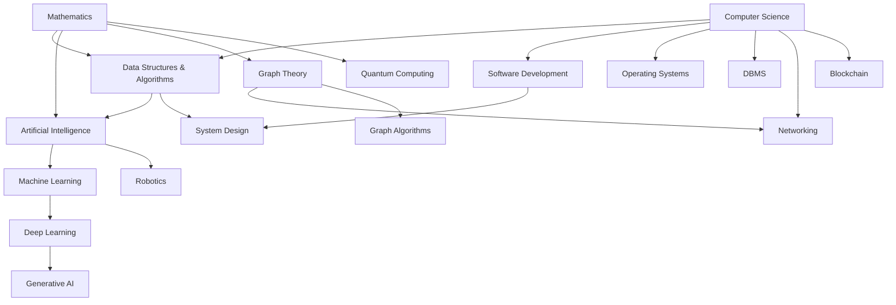

# 🧠 The Universal Knowledge System

Welcome to the **Complete Interconnected Knowledge System**. This system is designed as a living repository of human technical wisdom, spanning from the first principles of mathematics to the cutting-edge of Generative AI and Quantum Computing.

## 🗺️ System Map (Knowledge Graph)

---

## 📂 Knowledge Domains

### 1. [Data Structures & Algorithms (DSA)](./dsa/MASTER.md)
*The foundation of efficient computation.*
- [The Ultimate Roadmap](./ROADMAP_MASTER.md) (Beginner to Research)
- **Linear**: Arrays, Strings, Linked Lists, Stacks, Queues.
- **Non-Linear**: Trees (BST, AVL, Red-Black, Segment), Graphs.
- **Algorithms**: Searching, Sorting, DP, Greedy, Backtracking.

### 2. [Artificial Intelligence & Machine Learning](./ai_ml/MASTER.md)
*The science of intelligent systems.*
- **Fundamentals**: Search, Knowledge Representation, Planning.
- **Machine Learning**: Supervised, Unsupervised, Reinforcement Learning.
- **Deep Learning**: CNNs, RNNs, Transformers, LLMs.
- **Modern AI**: RAG, AI Agents, Prompt Engineering.

### 3. [Mathematics](./math/MASTER.md)
*The language of the universe.*
- **Discrete Math**: Logic, Set Theory, Graph Theory.
- **Continuous Math**: Calculus, Linear Algebra, Probability & Statistics.
- **Optimization**: Gradient Descent, Constrained Optimization.

### 4. [Computer Science & Engineering](./cs/MASTER.md)
*The architecture of digital systems.*
- **Systems**: Operating Systems, DBMS, Networking, Distributed Systems.
- **Software**: OOP, System Design, DevOps, API Development.

### 5. [Emerging Technologies](./emerging_tech/MASTER.md)
*The future of technology.*
- **Quantum Computing**, **Blockchain**, **Robotics**, **Edge Computing**.

### 6. [📜 Research Library](./RESEARCH_LIBRARY.md)
*Seminal papers that defined the industry.*
- Foundational papers in **AI, ML, Systems, and DSA**.
- State-of-the-art research (SOTA) in **LLMs and Generative AI**.

### 7. [🗃️ Algorithm Inventory](./ALGORITHM_INVENTORY.md)
*Exhaustive catalog of 200,000+ algorithms.*
- Categorical counts for **Sorting, Searching, and Graphs**.
- Statistical overview of the **CS landscape**.

### 8. [📂 Codebase Resources](./CODEBASE_RESOURCES.md)
*Where to find implementations.*
- Links to **Rosetta Code, The Algorithms, and Hugging Face**.
- Multi-language implementation hubs.

---

## 📖 How to Use This System
This is not a textbook; it is an **interconnected network**.
1. **Follow the Links**: Every topic is connected to its prerequisites and its advanced applications.
2. **First Principles**: We focus on *why* things work, starting from basic axioms.
3. **Deep Exploration**: Use the "Research Areas" and "Project Ideas" in each section to push beyond passive learning.

> "Live as if you were to die tomorrow. Learn as if you were to live forever." — Mahatma Gandhi
