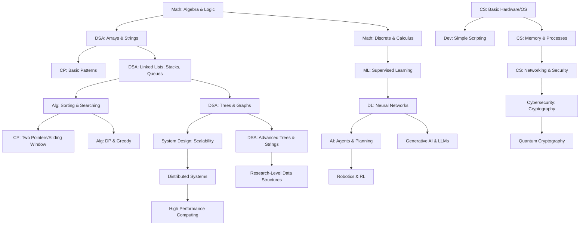

# 🗺️ Ultimate Computer Science & AI Roadmap

This document outlines the hierarchical progression from an absolute beginner to a world-class researcher. The system is divided into five proficiency levels, with strict dependency ordering.

## 📈 Proficiency Levels

| Level | Description | Focus |
| :--- | :--- | :--- |
| **L1: Beginner** | The Building Blocks | Syntax, Basic Logic, Arithmetic, Linear DS |
| **L2: Intermediate** | Algorithmic Thinking | Complexity, Recursion, Standard Algorithms, OOP |
| **L3: Advanced** | System & Pattern Mastery | DP, Graphs, System Design, ML Foundations |
| **L4: Expert** | Optimization & Scale | Distributed Systems, Deep Learning, OS Internals |
| **L5: Research** | Pushing the Frontier | SOTA Architectures, Quantum, Formal Proofs, Novel DS |

---

## ⛓️ Global Dependency Graph

---

## 🚦 Phase 1: Foundations (L1 - L2)
1. **Mathematics**: [Arithmetic, Basic Algebra, Set Theory]
2. **Programming**: [Syntax, Variables, Control Flow, Functions]
3. **Data Structures**: [Arrays, Strings, Matrices]
4. **Algorithms**: [Linear Search, Bubble Sort, Selection Sort]

## 🚦 Phase 2: Mastery (L3)
1. **Data Structures**: [Linked Lists, Stacks, Queues, Binary Trees, Heaps]
2. **Algorithms**: [Binary Search, Quick Sort, Merge Sort, Recursion]
3. **Computer Science**: [OS Basics, DBMS Foundations, Networking Models]

## 🚦 Phase 3: Specialization (L4)
1. **AI/ML**: [Regression, SVM, CNN, RNN, Reinforcement Learning]
2. **Systems**: [Microservices, Load Balancing, Consistency Algorithms]
3. **Advanced DSA**: [Segment Trees, Fenwick Trees, Suffix Arrays, Graphs]

## 🚦 Phase 4: Frontier (L5)
1. **Modern AI**: [Transformers, Diffusion Models, AI Agents, RAG]
2. **Advanced Systems**: [Parallel Computing, Consensus (Raft/Paxos), Kernel Dev]
3. **Research**: [Quantum Computing, Computational Complexity, Bio-Computing]

---

## 🔗 Navigation
- [Detailed DSA Module](./dsa/MASTER.md)
- [Detailed AI/ML Module](./ai_ml/MASTER.md)
- [Detailed Systems Module](./cs/MASTER.md)
- [Detailed Mathematics Module](./math/MASTER.md)
